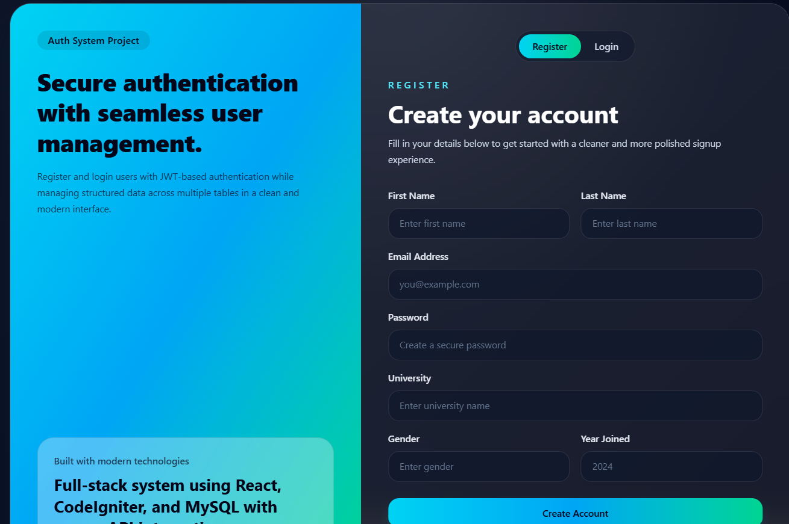
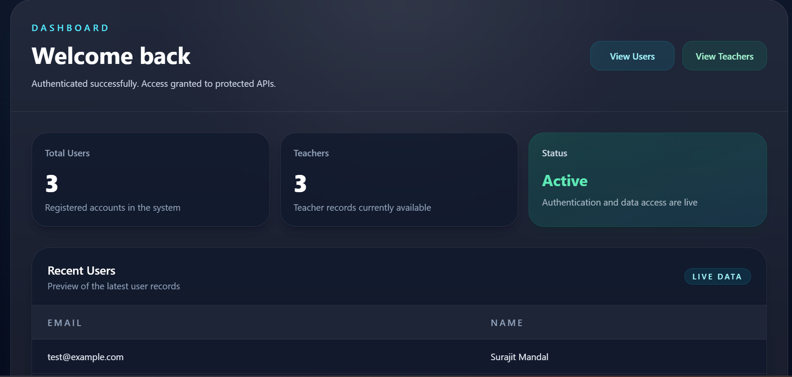

# 🔐 Fullstack Authentication System (React + CodeIgniter)

## 📌 Project Overview

This project is a **full-stack authentication system** built using **CodeIgniter 4 (Backend)** and **React.js (Frontend)**. It demonstrates secure **JWT-based authentication**, relational database design, and protected API access.

---

## 🚀 Features

* User Registration (inserts data into 2 tables)
* User Login with JWT Authentication
* Protected API routes using token-based authentication
* Dashboard with real-time data
* Users and Teachers data tables
* React protected routes (redirect if not logged in)
* Clean and modern UI using Tailwind CSS

---

## 🛠 Tech Stack

* **Frontend:** React.js (Vite), Tailwind CSS
* **Backend:** CodeIgniter 4 (PHP)
* **Database:** MySQL
* **Authentication:** JWT (JSON Web Token)

---

## 🗄️ Database Design

### 🔹 auth_user

* id
* email
* first_name
* last_name
* password

### 🔹 teachers

* id
* user_id (Foreign Key)
* university_name
* gender
* year_joined

👉 Relationship: **1:1 (One user has one teacher record)**

---

## 📸 Screenshots

### 🔹 Register 



### 🔹 Dashboard




---

## ⚙️ Setup Instructions

### 🔹 1. Clone Repository

```bash
git clone https://github.com/your-username/your-repo-name.git
```

---

### 🔹 2. Backend Setup (CodeIgniter)

1. Move `backend` folder to XAMPP `htdocs`
2. Start Apache & MySQL
3. Configure database in:

   ```
   app/Config/Database.php
   ```
4. Run backend:

   ```
   http://localhost/ci_auth_project/public
   ```

---

### 🔹 3. Database Setup

1. Open phpMyAdmin or MySQL Workbench
2. Create database:

   ```
   ci_auth_db
   ```
3. Import:

   ```
   /database/ci_auth_db.sql
   ```

---

### 🔹 4. Frontend Setup (React)

```bash
cd frontend
npm install
npm run dev
```

👉 Open:

```
http://localhost:5173
```

---

## 🔐 API Endpoints

| Method | Endpoint      | Description     |
| ------ | ------------- | --------------- |
| POST   | /api/register | Register user   |
| POST   | /api/login    | Login user      |
| GET    | /api/profile  | Protected route |
| GET    | /api/users    | Get users       |
| GET    | /api/teachers | Get teachers    |

---

## 🔑 Authentication Flow

* User logs in → receives JWT token
* Token stored in localStorage
* Token sent in Authorization header
* Protected APIs verify token

---

## 🎨 UI Highlights

* Responsive layout
* Tailwind CSS styling
* Dashboard with stats
* Smooth navigation

---

## 📌 Assignment Requirements Covered

✔ CodeIgniter application created
✔ Register & Login APIs implemented
✔ JWT-based authentication
✔ 2 tables with 1:1 relationship
✔ Single API inserting into both tables
✔ React app with UI and data tables
✔ Token-based protected routes

---

## 👨‍💻 Author

**Surajit Mandal**

